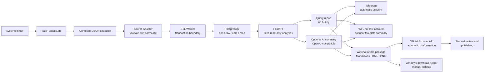

# JobFlow

[English](README.md) | [简体中文](README.zh-CN.md)

<p align="center">
  
</p>

> An open-source recruitment intelligence pipeline and lightweight AI data platform that turns compliant JSON snapshots into layered PostgreSQL data, read-only analytics APIs, trend briefs, and optional message delivery.


_Demo output generated from fully synthetic data. It does not represent full-market demand._

## Why JobFlow

Recruitment data projects often mix collection, cleaning, storage, analysis, AI, and delivery into one script. That makes failures difficult to isolate and makes a public demonstration depend on private accounts or live websites.

JobFlow separates those concerns. Its public workflow starts with a compliant, user-supplied JSON snapshot and provides a reproducible path through validation, transactional ETL, layered PostgreSQL storage, and read-only FastAPI analytics. AI summaries, Telegram delivery, Ubuntu scheduling, and restricted-network proxy support remain optional layers.

JobFlow is intended for learning, research, personal technical practice, and small self-hosted analytics. It is not an enterprise multi-tenant or high-availability data platform: it does not currently include a permissions center, data catalog, orchestration UI, observability suite, or HA topology.

## Key Features

- Validates a seven-field recruitment snapshot and normalizes salary, city, and skills data.
- Writes a batch through one ETL transaction, committing the successful batch or rolling it back on failure.
- Organizes PostgreSQL objects into `ops`, `raw`, `core`, and `mart` layers.
- Uses idempotent upserts for standardized job records.
- Exposes fixed read-only analytics for city counts, city salary statistics, and popular skills.
- Generates deterministic query-based reports without an AI key.
- Optionally summarizes fixed structured metrics through an OpenAI-compatible API.
- Optionally sends text and chart output through the Telegram Bot API.
- Optionally sends a WeChat test-account summary and creates a reviewable draft in a formal Official Account from the generated article package.
- Includes a portable Windows CMD/PowerShell helper that downloads and validates a generated WeChat article package while keeping credentials and publishing decisions local.
- Provides a guarded Bash daily workflow that operators can schedule with their own reviewed systemd units.
- Includes Pytest contracts and PostgreSQL integration tests, with Ruff for code quality.

## Architecture



The AI layer does not connect directly to PostgreSQL and cannot execute arbitrary SQL. It only receives the structured results returned by fixed application queries. Delivery channels do not participate in collection, normalization, or database writes. Telegram and WeChat have independent failure boundaries. V1.3.5 uploads the generated assets and creates a formal Official Account draft automatically; an operator still reviews and publishes it manually. The Windows helper remains a fallback.

## Quick Start

The default path uses the fully synthetic [public sample](examples/jobs.sample.json). It requires only Git, Docker Engine or Docker Desktop, and Docker Compose v2. Host Python is not required when you use Docker.

Before starting, make sure ports `5432` and `8000` are available, or change `POSTGRES_PORT` and `API_PORT` in your local `.env`.

### 1. Clone and prepare the sample

Linux or macOS:

```bash
git clone https://github.com/Altriaqe/JobFlow.git
cd JobFlow
cp .env.example .env
mkdir -p data/raw/inbox
cp examples/jobs.sample.json data/raw/inbox/jobs.json
```

Windows PowerShell:

```powershell
git clone https://github.com/Altriaqe/JobFlow.git
Set-Location JobFlow
Copy-Item .env.example .env
New-Item -ItemType Directory -Force data/raw/inbox | Out-Null
Copy-Item examples/jobs.sample.json data/raw/inbox/jobs.json
```

Open `.env` and replace the example database password with a password used only for your local deployment:

```dotenv
POSTGRES_PASSWORD=<YOUR_DATABASE_PASSWORD>
```

Replace the complete placeholder, including angle brackets. Never commit `.env`; it is ignored by Git.

### 2. Build the app image, migrate, import, and start the API

Run the same commands on Linux, macOS, or Windows PowerShell:

```bash
docker compose build api
docker compose up -d postgres
docker compose run --rm migrate
docker compose run --rm etl /data/raw/inbox/jobs.json
docker compose up -d api
docker compose ps
```

The ETL and API services share the `jobflow-app:local` image built from the current source tree. Run the build on the first setup and after pulling or changing application code; routine restarts do not require rebuilding it.

What each command does:

| Command | Purpose | Expected result |
| --- | --- | --- |
| `docker compose build api` | Builds the shared ETL/API image from the current source tree. | The `jobflow-app:local` image is created or refreshed. |
| `docker compose up -d postgres` | Starts PostgreSQL and its health check. | The `postgres` service becomes healthy. |
| `docker compose run --rm migrate` | Applies the ordered SQL migrations. | Each migration completes without a `psql` error. |
| `docker compose run --rm etl /data/raw/inbox/jobs.json` | Validates and imports the synthetic snapshot. | Output includes `ETL completed`. |
| `docker compose up -d api` | Starts FastAPI after PostgreSQL is healthy. | The `api` service becomes healthy. |
| `docker compose ps` | Shows long-running services. | `postgres` and `api` are running. |

### 3. Verify the base pipeline

Linux or macOS:

```bash
curl --fail http://127.0.0.1:8000/health
curl --fail http://127.0.0.1:8000/ready
curl --fail 'http://127.0.0.1:8000/analytics/cities?limit=20'
```

Windows PowerShell:

```powershell
Invoke-RestMethod http://127.0.0.1:8000/health
Invoke-RestMethod http://127.0.0.1:8000/ready
Invoke-RestMethod 'http://127.0.0.1:8000/analytics/cities?limit=20'
```

A successful run has all of these signals:

- `/health` returns `{"status":"ok"}`.
- `/ready` returns `{"status":"ready"}` and therefore confirms database connectivity.
- The city endpoint returns synthetic counts for Shanghai, Beijing, Hangzhou, and Shenzhen.
- Swagger UI opens at <http://127.0.0.1:8000/docs>.

Stop the services without deleting data:

```bash
docker compose down
```

Do not add `-v` unless you intentionally want to delete the PostgreSQL volume.

## API and Demo Output

The public analytics endpoints are read-only:

```bash
curl --fail 'http://127.0.0.1:8000/analytics/cities?limit=20'
curl --fail 'http://127.0.0.1:8000/analytics/salaries/cities?limit=20'
curl --fail 'http://127.0.0.1:8000/analytics/skills?limit=20'
```

`limit` defaults to `20` and accepts values from `1` to `100`. A valid request returns a JSON array; no matching data returns an empty array; an out-of-range value returns HTTP `422`.

With `examples/jobs.sample.json`, the city response has this shape:

```json
[
  {"city": "上海", "job_count": 4},
  {"city": "北京", "job_count": 3},
  {"city": "杭州", "job_count": 3},
  {"city": "深圳", "job_count": 2}
]
```

The chart shown at the top of this page is [generated by JobFlow's current chart module](docs/assets/jobflow-demo.png) from deterministic synthetic aggregates. It is a capability demonstration, not a claim about real market demand.

## Technology Stack

| Layer | Technology | Responsibility |
| --- | --- | --- |
| Runtime | Python 3.12 | Adapters, ETL, API, reports, and delivery logic |
| Database | PostgreSQL 18 | `ops/raw/core/mart` layers, transactions, views, and snapshots |
| API | FastAPI + Uvicorn | Health, readiness, analytics, and protected report endpoints |
| Data access | Psycopg 3 | Parameterized SQL, transactions, and writes |
| AI | OpenAI-compatible API | Optional summary of fixed structured metrics |
| Charts | Matplotlib | Keyword and city trend images |
| Delivery | Telegram Bot API | Optional text and image delivery |
| WeChat drafts | Official Account material and draft APIs | Optional asset upload and reviewable draft creation |
| Deployment | Docker + Docker Compose | PostgreSQL, migrations, ETL, and API services |
| Automation | Bash script + operator-configured systemd | Advanced Ubuntu daily execution and failure guards |
| Restricted networks | Optional Mihomo Compose override | Application egress for user-managed proxy environments |
| Quality | Pytest + Ruff | Unit, contract, integration, and static checks |

Python dependencies and supported versions are declared in [pyproject.toml](pyproject.toml). Container services are declared in [compose.yaml](compose.yaml).

## Project Structure

```text
JobFlow/
├── src/jobflow/
│   ├── adapters/       # Source validation, mapping, salary and skill normalization
│   ├── workers/        # ETL orchestration and transaction boundary
│   ├── db/             # PostgreSQL connections, writes, and fixed analytics SQL
│   ├── api/            # FastAPI health, analytics, and report routes
│   ├── reports/        # Query briefs, comparisons, charts, and delivery state
│   ├── ai/             # OpenAI-compatible summary adapter
│   ├── channels/       # Telegram and other output channels
│   ├── collectors/     # Basic HTTP collection example, not the advanced collector
│   └── models/         # Normalized JobRecord model
├── migrations/         # Ordered ops/raw/core/mart schema evolution
├── ops/                # Advanced Ubuntu daily-task orchestration
├── deploy/mihomo/      # Public proxy configuration template
├── examples/           # Fully synthetic public input
├── tests/              # Unit, contract, and PostgreSQL integration tests
├── docs/               # Architecture, deployment, compliance, and maintenance docs
├── compose.yaml        # Default direct-network deployment
├── compose.proxy.yaml  # Optional Mihomo deployment override
├── Dockerfile          # Python application image
├── .env.example        # Safe configuration template
└── pyproject.toml      # Package, dependencies, Pytest, and Ruff settings
```

The production-style browser collector used by the advanced daily workflow is an independent project and is not distributed with JobFlow.

## Optional AI Summary

AI is not required for the Quick Start.

- `mode=query` builds a deterministic report from fixed database query results and needs no AI key.
- `mode=ai` uses an OpenAI-compatible endpoint and requires your own credentials and available model.
- The model receives structured aggregates only; it does not receive PostgreSQL credentials and does not connect directly to the database.

Configure only when you choose `mode=ai`:

```dotenv
OPENAI_BASE_URL=<YOUR_OPENAI_COMPATIBLE_BASE_URL_OR_EMPTY>
OPENAI_API_KEY=<YOUR_OPENAI_API_KEY>
OPENAI_MODEL=<YOUR_AVAILABLE_MODEL>
```

Recreate the API container after changing `.env`:

```bash
docker compose up -d --force-recreate api
```

## Optional Telegram Delivery

Telegram delivery is also outside the default reproduction path. Use your own bot, destination, and independent report trigger token:

```dotenv
TELEGRAM_BOT_TOKEN=<YOUR_TELEGRAM_BOT_TOKEN>
TELEGRAM_CHAT_ID=<YOUR_TELEGRAM_CHAT_ID>
REPORT_TRIGGER_TOKEN=<YOUR_LONG_RANDOM_TRIGGER_TOKEN>
```

The city report endpoint supports both modes:

```text
POST /reports/cities/send?mode=query
POST /reports/cities/send?mode=ai
Authorization: Bearer <YOUR_REPORT_TRIGGER_TOKEN>
```

External delivery can have an uncertain result when a network failure occurs after Telegram receives a request. JobFlow does not automatically repeat an uncertain normal send. The advanced multi-keyword flow records delivery state and exposes an explicit photo-recovery path that requires visible confirmation of the text. See the [Ubuntu deployment and operations guide](docs/guides/ubuntu-deployment.md) for the recovery procedure.

Database ETL and external message delivery have separate failure boundaries: a Telegram failure does not undo a completed ETL transaction.

## Optional WeChat Official Account Delivery

V1.3.2 adds an optional WeChat test-account template channel and a local article package (`Markdown`, static `HTML`, `PNG`, and manifest). It is disabled by default, contains aggregate fixed-scope samples only, and runs independently from Telegram. Formal personal subscription accounts use manual review and publishing in the first version. See the [WeChat test-account setup guide](docs/guides/wechat-test-account.md) for configuration and server acceptance steps.

V1.3.4 adds an optional Windows download helper for self-hosted operators. It reads machine-specific SSH settings from local environment variables or command-line parameters, downloads one generated package, validates its manifest and required files, and leaves title, author, preview, and publishing under manual control. See the [Windows article-package download guide](docs/guides/wechat-article-download.md).

V1.3.5 adds automatic formal Official Account draft creation after article generation. It uploads the permanent cover and inline trend image, sends explicit UTF-8 JSON with WeChat-compatible inline styles, and records one idempotent draft state per date through Migration 010. A draft failure does not undo ETL or Telegram delivery, and JobFlow neither retries uncertain draft requests nor publishes automatically. See the [Official Account draft and troubleshooting guide](docs/guides/wechat-official-draft.md).

## Ubuntu Deployment

For an always-on self-hosted deployment, the high-level path is:

1. Install Git, Docker Engine, and Docker Compose v2 on Ubuntu.
2. Clone JobFlow, copy `.env.example` to a private `.env`, and fill only your own values.
3. Run the same PostgreSQL, migration, ETL, and API sequence from the Quick Start.
4. Review `ops/daily_update.sh`, then create and install systemd service/timer units that match your own user, paths, environment, and schedule.
5. Validate health, logs, snapshot state, and actual delivery before relying on scheduling.

The advanced daily workflow also needs an independent, legally authorized collector, a dedicated Chrome environment, and manual login or platform security verification where required. JobFlow does not bypass CAPTCHA, risk controls, authentication, login restrictions, or access controls.

The repository provides `ops/daily_update.sh`; it does not provide ready-to-install systemd unit files. See [Ubuntu deployment and operations guidance](docs/guides/ubuntu-deployment.md) for runtime checks, VNC-assisted login, failure handling, and recovery context. Review any unit you create before enabling it. Replace every placeholder such as `<SERVER_IP>`, `<SSH_USER>`, and `<JOBFLOW_DIR>` with your own private value; do not commit those values.

## Configuration and DIY

Start with [.env.example](.env.example). The most common settings are:

| Goal | Variables or files | Notes |
| --- | --- | --- |
| Change database identity or host ports | `POSTGRES_DB`, `POSTGRES_USER`, `POSTGRES_PASSWORD`, `POSTGRES_PORT` | Replace the example password before first start. |
| Change API binding | `API_BIND_HOST`, `API_PORT` | The default binds to loopback for local use. |
| Change Python package mirror or timeout | `PIP_INDEX_URL`, `PIP_DEFAULT_TIMEOUT` | Used while building the application image. |
| Configure direct application proxy variables | `JOBFLOW_HTTP_PROXY`, `JOBFLOW_HTTPS_PROXY`, `JOBFLOW_NO_PROXY` | Leave empty when direct access works. |
| Enable AI summaries | `OPENAI_BASE_URL`, `OPENAI_API_KEY`, `OPENAI_MODEL` | Needed only for `mode=ai`. |
| Enable Telegram reports | `TELEGRAM_BOT_TOKEN`, `TELEGRAM_CHAT_ID`, `REPORT_TRIGGER_TOKEN` | Keep each secret private and separate. |
| Enable Official Account drafts | `WECHAT_APP_ID`, `WECHAT_APP_SECRET`, `WECHAT_DRAFT_AUTHOR` | Do not mix formal-account and test-account credentials; publishing remains manual. |
| Change the query report format | `src/jobflow/reports/query_report.py` | Run the report tests after editing. |
| Change AI prompting | `src/jobflow/ai/openai_summary.py` | The current prompt is intentionally metric-bound. |
| Change Telegram transport | `src/jobflow/channels/telegram.py` | Preserve uncertain-result handling. |
| Change analytics | `src/jobflow/api/analytics.py`, `src/jobflow/db/analytics.py` | Keep public queries fixed and read-only. |
| Change field normalization | `src/jobflow/adapters/boss.py` | Update Adapter tests and sample contracts. |
| Change schema or marts | `migrations/*.sql` | Add a new migration; do not rewrite deployed history. |
| Change Ubuntu orchestration | `ops/daily_update.sh` | Run its Bash syntax and contract tests. |

### Optional proxy for restricted networks

The default [compose.yaml](compose.yaml) uses direct networking. [compose.proxy.yaml](compose.proxy.yaml) optionally adds a user-managed Mihomo service and points application egress at `http://mihomo:7890`.

Copy [deploy/mihomo/config.example.yaml](deploy/mihomo/config.example.yaml) into a private runtime directory and replace its placeholders with your own subscription or provider configuration. Never commit proxy subscriptions, nodes, credentials, or the generated runtime configuration.

Mihomo, its subscription, and its nodes are advanced user-managed options. The override supports application egress; it does not automatically configure a Docker daemon image-pull proxy. If direct access works, do not enable it.

## Development and Testing

Create a Python 3.12 environment, then install the project in editable mode:

```bash
python -m pip install -e ".[dev]"
pytest -q
ruff check .
ruff format --check .
```

PostgreSQL integration tests require a reachable test database configured through your local environment. Test counts change as the project evolves, so this README intentionally does not publish a fixed count or coverage badge.

Useful focused checks include:

```bash
pytest tests/adapters -q
pytest tests/api -q
pytest tests/reports -q
pytest tests/ops/test_daily_update_script.py -q
docker compose config --quiet
```

## Data, Security, and Compliance

- The public workflow begins with compliant JSON supplied by the user. JobFlow does not grant permission to collect or redistribute third-party data.
- `examples/jobs.sample.json` is fully synthetic. Its companies, records, and `example.com` URLs are not copied from a recruitment platform.
- JobFlow is provided for learning, research, and lawful technical practice. You are responsible for data authorization, platform terms, privacy requirements, and local law.
- JobFlow does not provide or endorse methods to bypass CAPTCHA, risk controls, authentication, login restrictions, rate limits, or access controls.
- Never commit `.env`, API keys, bot tokens, chat identifiers, cookies, browser profiles, private keys, proxy subscriptions, node credentials, logs containing secrets, or real recruitment snapshots.
- Expose only constrained aggregate APIs. Do not expose raw records, database ports, or arbitrary SQL endpoints to an untrusted network.
- Use separate secrets for database access, report authorization, Telegram, and AI services.
- The maintainers do not endorse or assume responsibility for a user's data source, deployment, or third-party service behavior.

The MIT License covers JobFlow-owned source code and documentation only. It does not license third-party data, websites, content, trademarks, credentials, or services.

## Roadmap

Potential future directions, subject to design and review:

- Additional user-supplied snapshot adapters with the same compliance boundary.
- More configurable keyword, city, and schedule settings.
- Improved chart presentation and longer comparison windows.
- Backup, restore, observability, and deployment diagnostics.
- Optional web views for self-hosted analytics.

Roadmap items are not commitments and should not be treated as currently available features.

## Contributing

Issues and pull requests are welcome for reproducible bug reports, tests, documentation, adapters for legally obtained data, and focused improvements.

Before opening a pull request:

1. Keep secrets, personal infrastructure, live cookies, and real recruitment snapshots out of commits.
2. Add or update tests for behavioral changes.
3. Run `pytest -q`, `ruff check .`, and `ruff format --check .` in Python 3.12.
4. Run `docker compose config --quiet` when changing deployment files.
5. Explain the data authorization boundary when proposing a new source adapter.

Please keep JobFlow focused: it is a lightweight pipeline, not a general-purpose enterprise data platform.

## License

JobFlow-owned code and documentation are released under the [MIT License](LICENSE), copyright 2026 Altriaqe.

This license does not cover third-party recruitment data, websites, content, trademarks, or credentials. See [Data, Security, and Compliance](#data-security-and-compliance) before using any external data source.

## Documentation

- [Documentation index](docs/README.md)
- [WeChat test-account setup](docs/guides/wechat-test-account.md)
- [WeChat Official Account draft and troubleshooting](docs/guides/wechat-official-draft.md)
- [Windows WeChat article-package download helper](docs/guides/wechat-article-download.md)
- [Architecture and implementation status](docs/reference/architecture.md)
- [Ubuntu deployment and operations](docs/guides/ubuntu-deployment.md)
- [Data sources and compliance boundary](docs/reference/data-sources.md)
- [Learning and troubleshooting notes](docs/development/learning-notes.md)
- [Platform evolution design](docs/reference/platform-evolution-design.md)
