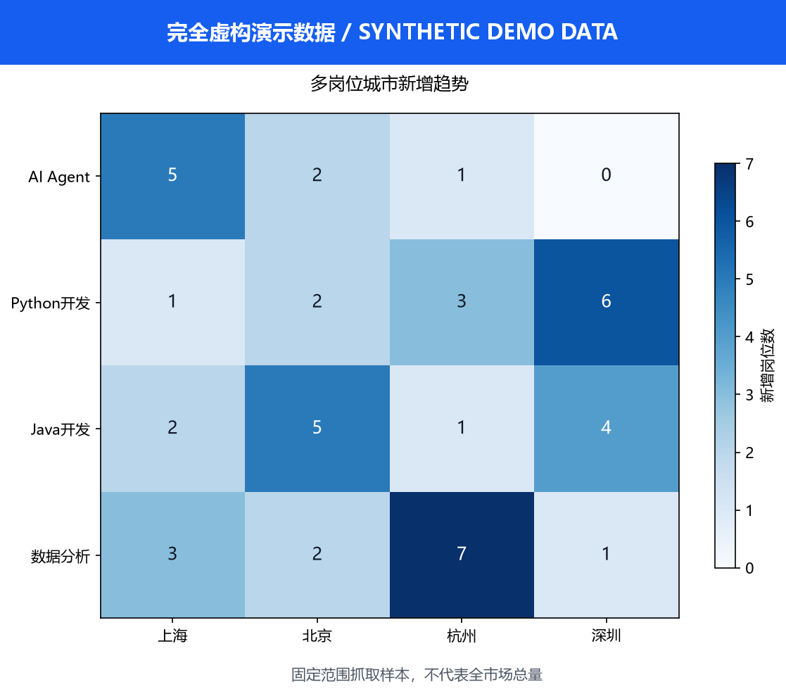
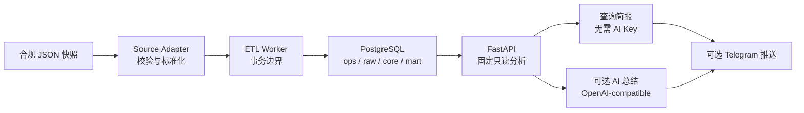

# JobFlow

[English](README.md) | [简体中文](README.zh-CN.md)

<p align="center">
  
</p>

> 一个开源招聘数据智能流水线和轻量级 AI 数据平台，将合规 JSON 快照转换为 PostgreSQL 分层数据、只读分析 API、趋势简报和可选消息推送。




_演示结果由完全虚构的数据生成，不代表完整市场需求。_

## 为什么使用 JobFlow

招聘数据项目常把采集、清洗、存储、分析、AI 和消息推送混在一个脚本里。这会让故障难以隔离，也会使公开演示依赖私人账号或在线网站。

JobFlow 将这些职责分开。公开工作流从用户合法获得并提供的 JSON 快照开始，提供一条可复现路径：字段校验、事务化 ETL、PostgreSQL 分层存储以及 FastAPI 只读分析。AI 总结、Telegram 推送、Ubuntu 定时运行和受限网络代理均为可选层。

JobFlow 面向学习、研究、个人技术实践和小型自托管分析。它不是企业级多租户或高可用数据平台：目前不包含权限中心、数据目录、任务编排界面、完整可观测性套件或高可用拓扑。

## 核心能力

- 校验七字段招聘快照，并标准化薪资、城市和技能数据。
- 单批次使用一个 ETL 事务，成功时整体提交，失败时整体回滚。
- 按 `ops`、`raw`、`core` 和 `mart` 组织 PostgreSQL 对象。
- 使用幂等 upsert 写入标准化岗位记录。
- 提供城市岗位数、城市薪资统计和热门技能等固定只读分析。
- 无需 AI Key 即可生成确定性的查询简报。
- 可通过 OpenAI-compatible API 总结固定的结构化指标。
- 可通过 Telegram Bot API 发送文字与图表。
- 可通过微信测试号发送聚合模板摘要，并生成供人工检查发布的公众号文章排版包。
- 提供带保护逻辑的 Bash 每日工作流，运维者可使用自行审查的 systemd unit 调度。
- 包含 Pytest 契约测试和 PostgreSQL 集成测试，并使用 Ruff 保证代码质量。

## 架构与数据流



AI 层不直接连接 PostgreSQL，也不能执行任意 SQL；它只接收固定应用查询返回的结构化结果。消息渠道不参与采集、标准化或数据库写入。

## 10 分钟 Docker 复现

默认路径使用完全虚构的[公开样本](examples/jobs.sample.json)。只需 Git、Docker Engine 或 Docker Desktop，以及 Docker Compose v2。使用 Docker 时，宿主机无需安装 Python。

开始前请确认端口 `5432` 和 `8000` 可用；否则在本地 `.env` 中修改 `POSTGRES_PORT` 和 `API_PORT`。

### 1. 克隆仓库并准备样本

Linux 或 macOS：

```bash
git clone https://github.com/Altriaqe/JobFlow.git
cd JobFlow
cp .env.example .env
mkdir -p data/raw/inbox
cp examples/jobs.sample.json data/raw/inbox/jobs.json
```

Windows PowerShell：

```powershell
git clone https://github.com/Altriaqe/JobFlow.git
Set-Location JobFlow
Copy-Item .env.example .env
New-Item -ItemType Directory -Force data/raw/inbox | Out-Null
Copy-Item examples/jobs.sample.json data/raw/inbox/jobs.json
```

打开 `.env`，把示例数据库密码替换为仅用于本地部署的密码：

```dotenv
POSTGRES_PASSWORD=<YOUR_DATABASE_PASSWORD>
```

请替换包括尖括号在内的完整占位符。不要提交 `.env`；它已被 Git 忽略。

### 2. 构建应用镜像、迁移、导入并启动 API

以下命令在 Linux、macOS 和 Windows PowerShell 中相同：

```bash
docker compose build api
docker compose up -d postgres
docker compose run --rm migrate
docker compose run --rm etl /data/raw/inbox/jobs.json
docker compose up -d api
docker compose ps
```

ETL 与 API 共用从当前源码构建的 `jobflow-app:local` 镜像。首次部署，以及拉取或修改应用代码后需要执行构建；日常重启服务不需要重复构建。

每条命令的作用：

| 命令 | 作用 | 预期结果 |
| --- | --- | --- |
| `docker compose build api` | 使用当前源码构建 ETL/API 共用镜像。 | 创建或更新 `jobflow-app:local` 镜像。 |
| `docker compose up -d postgres` | 启动 PostgreSQL 和健康检查。 | `postgres` 服务变为 healthy。 |
| `docker compose run --rm migrate` | 按顺序执行 SQL Migration。 | 每个 Migration 均完成且没有 `psql` 错误。 |
| `docker compose run --rm etl /data/raw/inbox/jobs.json` | 校验并导入虚构快照。 | 输出包含 `ETL completed`。 |
| `docker compose up -d api` | PostgreSQL 健康后启动 FastAPI。 | `api` 服务变为 healthy。 |
| `docker compose ps` | 查看长期运行的服务。 | `postgres` 和 `api` 正在运行。 |

### 3. 验证基础流水线

Linux 或 macOS：

```bash
curl --fail http://127.0.0.1:8000/health
curl --fail http://127.0.0.1:8000/ready
curl --fail 'http://127.0.0.1:8000/analytics/cities?limit=20'
```

Windows PowerShell：

```powershell
Invoke-RestMethod http://127.0.0.1:8000/health
Invoke-RestMethod http://127.0.0.1:8000/ready
Invoke-RestMethod 'http://127.0.0.1:8000/analytics/cities?limit=20'
```

成功运行应同时满足：

- `/health` 返回 `{"status":"ok"}`。
- `/ready` 返回 `{"status":"ready"}`，从而确认数据库可连接。
- 城市接口返回上海、北京、杭州和深圳的虚构样本聚合结果。
- Swagger UI 可通过 <http://127.0.0.1:8000/docs> 打开。

停止服务但保留数据：

```bash
docker compose down
```

除非确实要删除 PostgreSQL 数据卷，否则不要添加 `-v`。

## API 与演示效果

公开分析接口均为只读：

```bash
curl --fail 'http://127.0.0.1:8000/analytics/cities?limit=20'
curl --fail 'http://127.0.0.1:8000/analytics/salaries/cities?limit=20'
curl --fail 'http://127.0.0.1:8000/analytics/skills?limit=20'
```

`limit` 默认值为 `20`，允许范围为 `1` 到 `100`。有效请求返回 JSON 数组；没有匹配数据时返回空数组；超出范围时返回 HTTP `422`。

使用 `examples/jobs.sample.json` 后，城市接口响应形状如下：

```json
[
  {"city": "上海", "job_count": 4},
  {"city": "北京", "job_count": 3},
  {"city": "杭州", "job_count": 3},
  {"city": "深圳", "job_count": 2}
]
```

页面顶部图表由 [JobFlow 当前图表模块](docs/assets/jobflow-demo.png)根据确定性的虚构聚合数据生成。它只用于展示能力，不代表真实市场需求。

## 技术栈

| 层级 | 技术 | 职责 |
| --- | --- | --- |
| 运行时 | Python 3.12 | Adapter、ETL、API、报告和消息逻辑 |
| 数据库 | PostgreSQL 18 | `ops/raw/core/mart` 分层、事务、View 和快照 |
| API | FastAPI + Uvicorn | 健康检查、就绪检查、分析和受保护的报告接口 |
| 数据访问 | Psycopg 3 | 参数化 SQL、事务和写入 |
| AI | OpenAI-compatible API | 可选地总结固定结构化指标 |
| 图表 | Matplotlib | 关键词与城市趋势图 |
| 消息渠道 | Telegram Bot API | 可选文字和图片推送 |
| 部署 | Docker + Docker Compose | PostgreSQL、Migration、ETL 和 API 服务 |
| 自动化 | Bash 脚本 + 运维者配置的 systemd | Ubuntu 高级每日运行和失败保护 |
| 受限网络 | 可选 Mihomo Compose 覆盖配置 | 用户自行管理的代理环境中的应用出站 |
| 质量 | Pytest + Ruff | 单元、契约、集成和静态检查 |

Python 依赖和支持版本声明在 [pyproject.toml](pyproject.toml)，容器服务声明在 [compose.yaml](compose.yaml)。

## 项目结构

```text
JobFlow/
├── src/jobflow/
│   ├── adapters/       # 数据源校验、映射、薪资与技能标准化
│   ├── workers/        # ETL 编排和事务边界
│   ├── db/             # PostgreSQL 连接、写入和固定分析 SQL
│   ├── api/            # FastAPI 健康、分析和报告路由
│   ├── reports/        # 查询简报、对比、图表和推送状态
│   ├── ai/             # OpenAI-compatible 总结适配器
│   ├── channels/       # Telegram 等输出渠道
│   ├── collectors/     # 基础 HTTP 采集示例，不是高级采集器
│   └── models/         # 标准化 JobRecord 模型
├── migrations/         # 按顺序演进 ops/raw/core/mart Schema
├── ops/                # Ubuntu 高级每日任务编排
├── deploy/mihomo/      # 公开代理配置模板
├── examples/           # 完全虚构的公开输入
├── tests/              # 单元、契约和 PostgreSQL 集成测试
├── docs/               # 架构、部署、合规和维护文档
├── compose.yaml        # 默认直连网络部署
├── compose.proxy.yaml  # 可选 Mihomo 部署覆盖
├── Dockerfile          # Python 应用镜像
├── .env.example        # 安全配置模板
└── pyproject.toml      # 包、依赖、Pytest 和 Ruff 设置
```

高级每日工作流使用的生产式浏览器采集器是独立项目，不随 JobFlow 发布。

## 可选 AI 总结

Quick Start 不需要 AI。

- `mode=query` 使用固定数据库查询结果生成确定性报告，无需 AI Key。
- `mode=ai` 使用 OpenAI-compatible 接口，需要你自己的凭据和可用模型。
- 模型只接收结构化聚合指标；它不会获得 PostgreSQL 凭据，也不直接连接数据库。

仅当你选择 `mode=ai` 时配置：

```dotenv
OPENAI_BASE_URL=<YOUR_OPENAI_COMPATIBLE_BASE_URL_OR_EMPTY>
OPENAI_API_KEY=<YOUR_OPENAI_API_KEY>
OPENAI_MODEL=<YOUR_AVAILABLE_MODEL>
```

修改 `.env` 后重新创建 API 容器：

```bash
docker compose up -d --force-recreate api
```

## 可选 Telegram 推送

Telegram 推送同样不属于默认复现路径。请使用你自己的机器人、接收目标和独立报告触发 Token：

```dotenv
TELEGRAM_BOT_TOKEN=<YOUR_TELEGRAM_BOT_TOKEN>
TELEGRAM_CHAT_ID=<YOUR_TELEGRAM_CHAT_ID>
REPORT_TRIGGER_TOKEN=<YOUR_LONG_RANDOM_TRIGGER_TOKEN>
```

城市报告接口支持两种模式：

```text
POST /reports/cities/send?mode=query
POST /reports/cities/send?mode=ai
Authorization: Bearer <YOUR_REPORT_TRIGGER_TOKEN>
```

如果 Telegram 已收到请求后才发生网络故障，外部消息推送的结果可能不确定。JobFlow 不会自动重复一次结果不确定的普通发送。高级多关键词流程会记录推送状态，并提供显式的仅补图恢复路径；该操作要求人工确认文字已可见。恢复流程参见 [Ubuntu 部署与运维指南](docs/guides/ubuntu-deployment.md)。

数据库 ETL 与外部消息推送具有不同的失败边界：Telegram 发送失败不会回滚已经完成的 ETL 事务。

## 可选微信公众号推送

V1.3.2 增加可选的微信测试号模板摘要，以及由 `Markdown`、静态 `HTML`、`PNG` 和清单组成的公众号文章排版包。该功能默认关闭，只包含固定范围聚合样本，与 Telegram 独立运行。正式个人订阅号首版采用人工检查和发布。配置与服务器验收步骤参见[微信测试号配置指南](docs/guides/wechat-test-account.md)。

## Ubuntu 部署

对于长期运行的自托管部署，高层流程如下：

1. 在 Ubuntu 安装 Git、Docker Engine 和 Docker Compose v2。
2. 克隆 JobFlow，把 `.env.example` 复制为私有 `.env`，并只填写你自己的配置。
3. 按 Quick Start 使用相同命令运行 PostgreSQL、Migration、ETL 和 API。
4. 审查 `ops/daily_update.sh`，再创建并安装与你自己的用户、路径、环境和调度时间匹配的 systemd service/timer unit。
5. 在依赖定时任务前，验证健康状态、日志、快照状态和真实推送结果。

高级每日工作流还需要一个独立、合法授权的采集器、专用 Chrome 环境，以及平台要求的人工登录或安全验证。JobFlow 不会绕过验证码、风控、身份验证、登录限制或访问控制。

仓库提供 `ops/daily_update.sh`，**不提供可直接安装的 systemd unit 文件**。运行检查、VNC 辅助登录、失败处理和恢复背景参见 [Ubuntu 部署与运维指南](docs/guides/ubuntu-deployment.md)。启用前请审查你自行创建的每个 unit。将 `<SERVER_IP>`、`<SSH_USER>` 和 `<JOBFLOW_DIR>` 等所有占位符替换为你自己的私有值，并且不要提交这些值。

## 配置与 DIY

请从 [.env.example](.env.example) 开始。常用设置如下：

| 目标 | 变量或文件 | 说明 |
| --- | --- | --- |
| 修改数据库身份或宿主机端口 | `POSTGRES_DB`、`POSTGRES_USER`、`POSTGRES_PASSWORD`、`POSTGRES_PORT` | 首次启动前替换示例密码。 |
| 修改 API 绑定 | `API_BIND_HOST`、`API_PORT` | 默认绑定回环地址供本地使用。 |
| 修改 Python 包镜像或超时 | `PIP_INDEX_URL`、`PIP_DEFAULT_TIMEOUT` | 构建应用镜像时使用。 |
| 配置应用直连代理变量 | `JOBFLOW_HTTP_PROXY`、`JOBFLOW_HTTPS_PROXY`、`JOBFLOW_NO_PROXY` | 网络可直连时留空。 |
| 启用 AI 总结 | `OPENAI_BASE_URL`、`OPENAI_API_KEY`、`OPENAI_MODEL` | 仅 `mode=ai` 需要。 |
| 启用 Telegram 报告 | `TELEGRAM_BOT_TOKEN`、`TELEGRAM_CHAT_ID`、`REPORT_TRIGGER_TOKEN` | 各项密钥保持私有并相互独立。 |
| 修改查询报告格式 | `src/jobflow/reports/query_report.py` | 修改后运行报告测试。 |
| 修改 AI Prompt | `src/jobflow/ai/openai_summary.py` | 当前 Prompt 有意限定为指标总结。 |
| 修改 Telegram 传输 | `src/jobflow/channels/telegram.py` | 保留不确定结果的处理逻辑。 |
| 修改分析能力 | `src/jobflow/api/analytics.py`、`src/jobflow/db/analytics.py` | 保持公开查询固定且只读。 |
| 修改字段标准化 | `src/jobflow/adapters/boss.py` | 同步更新 Adapter 测试和样本契约。 |
| 修改 Schema 或 Mart | `migrations/*.sql` | 添加新 Migration，不要重写已部署历史。 |
| 修改 Ubuntu 编排 | `ops/daily_update.sh` | 运行 Bash 语法和契约测试。 |

### 受限网络的可选代理

默认 [compose.yaml](compose.yaml) 使用直连网络。[compose.proxy.yaml](compose.proxy.yaml) 可选地添加用户自行管理的 Mihomo 服务，并让应用出站使用 `http://mihomo:7890`。

将 [deploy/mihomo/config.example.yaml](deploy/mihomo/config.example.yaml) 复制到私有运行目录，再用你自己的订阅或 provider 配置替换占位符。不要提交代理订阅、节点、凭据或生成后的运行配置。

Mihomo、订阅和节点都是用户自行管理的高级选项。该覆盖配置支持应用出站，但不会自动配置 Docker daemon 的镜像拉取代理。如果网络可以直连，请勿启用。

## 本地开发与测试

创建 Python 3.12 环境，然后以 editable 模式安装项目：

```bash
python -m pip install -e ".[dev]"
pytest -q
ruff check .
ruff format --check .
```

PostgreSQL 集成测试需要一个可连接、并通过本地环境配置的测试数据库。测试数量会随项目演进而变化，因此 README 不公布固定测试数或覆盖率徽章。

常用聚焦检查：

```bash
pytest tests/adapters -q
pytest tests/api -q
pytest tests/reports -q
pytest tests/ops/test_daily_update_script.py -q
docker compose config --quiet
```

## 数据、安全与合规

- 公开工作流从用户提供的合规 JSON 开始。JobFlow 不授予采集或再分发第三方数据的权限。
- `examples/jobs.sample.json` 完全虚构，其中的公司、记录和 `example.com` 链接均非复制自招聘平台。
- JobFlow 仅用于学习、研究和合法技术实践。你需要自行负责数据授权、平台条款、隐私要求和当地法律。
- JobFlow 不提供或认可绕过验证码、风控、身份验证、登录限制、速率限制或访问控制的方法。
- 不要提交 `.env`、API Key、Bot Token、Chat ID、Cookie、浏览器 Profile、私钥、代理订阅、节点凭据、含密钥日志或真实招聘快照。
- 只暴露受约束的聚合 API。不要向不可信网络暴露原始记录、数据库端口或任意 SQL 接口。
- 数据库访问、报告授权、Telegram 和 AI 服务应使用相互独立的密钥。
- 维护者不认可也不为使用者的数据来源、部署方式或第三方服务行为承担责任。

MIT License 只覆盖 JobFlow 自有源代码和文档，不授权第三方数据、网站、内容、商标、凭据或服务。

## 路线图

以下方向可能在完成设计和审查后推进：

- 在相同合规边界下增加更多用户提供快照的 Adapter。
- 提供更灵活的关键词、城市和调度配置。
- 改进图表表现并支持更长的对比周期。
- 增加备份、恢复、可观测性和部署诊断。
- 为自托管分析提供可选 Web 视图。

路线图不是承诺，也不应被视为当前已提供的能力。

## 参与贡献

欢迎通过 Issue 和 Pull Request 提交可复现的错误报告、测试、文档、合法取得数据的 Adapter 以及范围明确的改进。

提交 Pull Request 前：

1. 不要在提交中包含密钥、个人基础设施、有效 Cookie 或真实招聘快照。
2. 行为变更需添加或更新测试。
3. 在 Python 3.12 中运行 `pytest -q`、`ruff check .` 和 `ruff format --check .`。
4. 修改部署文件时运行 `docker compose config --quiet`。
5. 提议新数据源 Adapter 时说明数据授权边界。

请保持 JobFlow 的清晰定位：它是轻量级流水线，不是通用企业数据平台。

## 许可证

JobFlow 自有代码和文档依据 [MIT License](LICENSE) 发布，版权归 2026 Altriaqe 所有。

该许可证不覆盖第三方招聘数据、网站、内容、商标或凭据。使用任何外部数据源前，请阅读[数据、安全与合规](#数据安全与合规)。

## 详细文档

- [文档索引](docs/README.md)
- [微信测试号配置指南](docs/guides/wechat-test-account.md)
- [架构与实现状态](docs/reference/architecture.md)
- [Ubuntu 部署与运维](docs/guides/ubuntu-deployment.md)
- [数据源与合规边界](docs/reference/data-sources.md)
- [学习与故障排查笔记](docs/development/learning-notes.md)
- [平台演进设计](docs/reference/platform-evolution-design.md)
